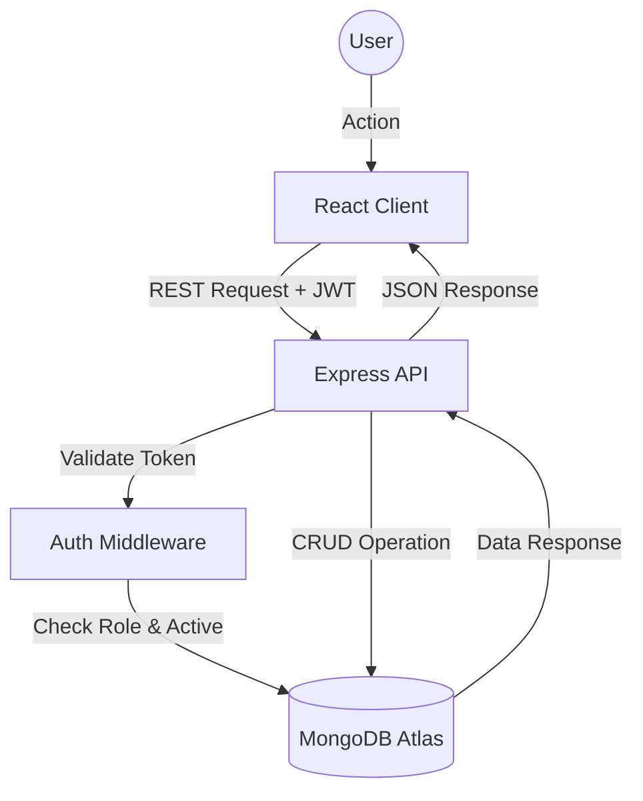
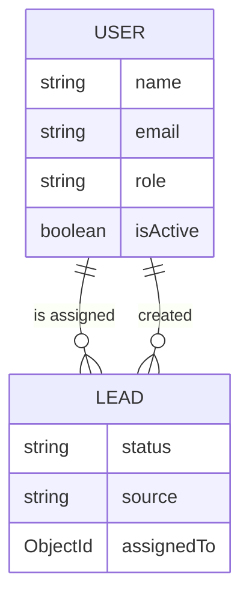

<<<<<<< HEAD
# LeadFlow – Lead Management System

**Streamlining Sales Operations with Intelligent Lead Tracking and Analytics**

LeadFlow is a high-performance, full-stack **Lead Management System (LMS)** designed to help sales teams verify, track, and convert leads into customers through a streamlined role-based interface. Built on the MERN stack, it serves as a central hub for sales organizations to manage their pipeline effectively.

### Problem Statement
Sales teams often struggle with fragmented data, lack of visibility into lead status, and inefficient communication between managers and agents. Spreadsheets and legacy tools fail to provide real-time insights or enforce process discipline, leading to lost opportunities and lower conversion rates.

### Solution
LeadFlow solves these challenges by providing a unified platform where:
*   **Admins** (Managers) can oversee the entire pipeline, assign leads, and monitor team performance via real-time analytics.
*   **Sales Agents** can focus purely on their assigned leads, updating statuses and adding notes without distraction.
The system enforces strict data isolation and workflow rules, ensuring that no lead is left behind.

### High-Level Approach
The application utilizes a **Client-Server Architecture** where a React frontend communicates with a RESTful Node.js API. Data is stored in MongoDB Atlas, ensuring scalability. Security is paramount, with JWT-based authentication, role-based access control (RBAC), and immediate account termination capabilities. The user experience is optimized with skeleton loading states, debounced search, and responsive design for mobile access.

---

# 2. Live Demo & Repository

*   **Live Demo:** [Insert Live Demo Link Here]
*   **GitHub Repository:** [Insert GitHub Repo Link Here]

---

# 3. Tech Stack

## Frontend (Client)
*   **React 18:** Component-based library for building dynamic user interfaces.
*   **Vite:** Next-generation frontend tooling for lightning-fast builds and HMR.
*   **TailwindCSS:** Utility-first CSS framework for rapid, responsive styling.
*   **Recharts:** Composable charting library for visualizing sales data.
*   **Framer Motion:** Animation library to create smooth transitions and interactive elements.
*   **Lucide Icons:** Consistent, lightweight icon set for modern UI.

## Backend (Server)
*   **Node.js:** JavaScript runtime for scalable network applications.
*   **Express.js:** Minimal web framework for building robust REST APIs.
*   **JWT Authentication:** Stateless authentication mechanism for secure API access.
*   **Bcrypt:** Password hashing library to ensuring credential security.
*   **Mongoose:** ODM library for MongoDB, providing schema validation and easy data modeling.

## Database
*   **MongoDB Atlas:** Cloud-hosted NoSQL database for flexible data storage and high availability.

### Why these choices?
*   **JWT over Sessions:** Enables stateless authentication, making horizontal scaling easier as no server-side session store is required.
*   **Mongoose over Raw Driver:** Provides strict schema validation, ensuring data integrity (e.g., verifying `enum` values for status) before it ever reaches the database.
*   **Context API over Redux:** The application state (Auth, Leads) is global but not overly complex. Context API provides a native, lightweight solution without the boilerplate and bundle size overhead of Redux.

---

# 4. System Architecture

LeadFlow follows a standard **Client-Server Architecture**.

### Data Flow
1.  **User Interaction:** User clicks "Add Lead" in the React Client.
2.  **API Request:** Frontend validates input and sends a `POST /api/leads` request with the JWT token in the header.
3.  **Server Processing:** Express server receives the request, passes it through `authMiddleware` to verify the token and `user.isActive` status.
4.  **Database Operation:** Mongoose creates the document in MongoDB Atlas.
5.  **Response:** The new lead object is returned to the client and the UI updates immediately via Context.

### Authentication & Authorization Flow
1.  **Login:** User sends credentials -> Server verifies hash -> Returns JWT.
2.  **Request:** Client sends JWT in `Authorization: Bearer <token>` header.
3.  **Validation:** Middleware decodes token -> Finds User in DB -> Checks `isActive` -> Approves/Denies request.
4.  **Role Check:** Specific routes (e.g., `deleteLead`) check `req.user.role === 'admin'`.

### Diagram


---

# 5. Database Design

### User Schema (`users`)
Stores system users (Admins and Sales Agents).

*   **Fields:**
    *   `name` (String, Required)
    *   `email` (String, Unique, Required)
    *   `password` (String, Hashed)
    *   `role` (Enum: `admin`, `sales`)
    *   `isActive` (Boolean, Default: `true`) - **Critical for soft-banning.**
    *   `profilePic` (String, URL)
*   **Indexes:** Unique index on `email`.

### Lead Schema (`leads`)
Stores prospect information and workflow status.

*   **Fields:**
    *   `leadId` (String, Unique) - Readable ID (e.g., `L12345`).
    *   `name` (String, Required)
    *   `status` (Enum: `New`, `Contacted`, `Converted`, `Lost`)
    *   `source` (String)
    *   `assignedTo` (Ref: `User`) - The owner of the lead.
    *   `createdBy` (Ref: `User`)
    *   `notes` (Array of Embedded Objects)
*   **Indexes:** Indexes on `assignedTo` for fast filtering by sales agent.

### ER Diagram


---

# 6. Authentication & Security

*   **JWT Structure:** Tokens are signed with a `JWT_SECRET` and contain the user's `_id`. They expire in 30 days.
*   **Protect Middleware:**
    1.  Extracts token from header.
    2.  Decodes ID.
    3.  Fetches User from DB.
    4.  **Security Check:** Verifies `user.isActive === true`. This allows admins to instantly revoke access to a user without waiting for the token to expire.
*   **Authorization:** Middleware `authorize('admin')` ensures only admins can access sensitive routes.
*   **Password Hashing:** Uses `bcryptjs` with a salt round of 10 to hash passwords before saving.
*   **Best Practices:**
    *   Passwords never stored in plain text.
    *   Tokens stored in `localStorage` (for this implementation) - *Production note: HttpOnly cookies recommended for higher security.*
    *   API rate limiting (planned).

---

# 7. Role-Based Access Control (RBAC)

| Feature | Admin | Sales Agent |
| :--- | :--- | :--- |
| **View Leads** | All Leads (Global View) | Only Assigned Leads |
| **Create Leads** | Yes (Must Assign Agent) | Yes (Auto-assigned to Self) |
| **Delete Leads** | Yes | No |
| **Update Leads** | Full Edits (Name, Email, etc.) | Status & Notes Only |
| **User Management** | Create / Delete / View All | View Own Profile Only |
| **Dashboard Stats** | Company-wide Performance | Personal Performance |

**Enforcement:**
*   **Backend:** Mongoose queries automatically filter `find({ assignedTo: req.user._id })` for sales users.
*   **Frontend:** UI elements (like "Delete" buttons) are conditionally rendered based on `user.role`.

---

# 8. Core Features

### Lead Management
*   **Workflows:** Leads move through distinct stages: `New` -> `Contacted` -> `Converted` / `Lost`.
*   **Assignment:** Admins can reassign leads to balance workload.
*   **Notes:** Agents can append timestamped notes to the lead timeline.

### Dashboard & Analytics
*   **Trend Logic:**
    *   Calculates percentage change vs. previous period.
    *   **Smart Indicators:** An increase in "Converted" is Green (Positive). An increase in "Lost" is Red (Negative).
*   **Chart Implementation:** Visualizes lead growth over the last 7 days and distribution by source.

### User Management
*   **Soft Delete:** Admins can set `isActive: false` to block access immediately while preserving data integrity.
*   **Termination:** If a user is deleted, their leads are automatically reassigned to the Admin to prevent orphaned data.

---

# 9. Frontend Architecture

### Folder Structure

#### Frontend (`/frontend`)
```
src/
├── components/
│   ├── common/
│   │   ├── Skeleton.jsx       # Reusable loading placeholders (Cards, Tables)
│   │   ├── StatCard.jsx       # Dashboard KPI card with trend indicators
│   │   └── Modal.jsx          # Generic modal wrapper
│   ├── dashboard/
│   │   ├── AnalyticsCharts.jsx # Recharts implementation for trends
│   │   └── RecentLeads.jsx    # Dashboard widget for latest 5 leads
│   ├── layout/
│   │   ├── Sidebar.jsx        # Navigation menu with RBAC logic
│   │   └── Header.jsx         # Top bar with User Profile & Logout
│   └── Breadcrumb.jsx         # Dynamic navigation path helper
├── context/
│   ├── AuthContext.jsx        # Manages User Session & JWT Token
│   └── LeadsContext.jsx       # Global State for Leads & Stats
├── pages/
│   ├── Dashboard.jsx          # Main Analytics View
│   ├── Leads.jsx              # Lead List (Table/Grid) with Filters
│   ├── LeadDetails.jsx        # Single Lead View + Notes Timeline
│   ├── AddLead.jsx            # Create Lead Form
│   ├── Users.jsx              # (Admin) User Management List
│   ├── Profile.jsx            # User Profile & Settings
│   ├── Login.jsx              # Authentication Entry
│   └── Register.jsx           # New User Signup
└── utils/
    └── analyticsUtils.js      # Helpers for trend calculation & logic
```

#### Backend (`/backend`)
```
├── config/
│   └── db.js                  # MongoDB Connection Logic
├── controllers/
│   ├── authController.js      # Login/Register Logic
│   ├── leadController.js      # CRUD + Assignment Logic
│   └── userController.js      # Profile & Admin User Management
├── middleware/
│   ├── authMiddleware.js      # JWT Verification & Soft-Ban Check
│   └── errorMiddleware.js     # Global Error Handler
├── models/
│   ├── Lead.js                # Schema with Status Enum & Notes
│   └── User.js                # Schema with Role & isActive Flag
├── routes/
│   ├── authRoutes.js          # /api/auth endpoints
│   ├── leadRoutes.js          # /api/leads endpoints
│   └── userRoutes.js          # /api/users endpoints
└── server.js                  # Entry Point & App Configuration
```

### Key Concepts
*   **Context API:** `AuthContext` handles session persistence across refreshes. `LeadsContext` caches lead data to avoid redundant fetching.
*   **Skeleton Loading:** Custom `Skeleton` components replace content while loading to specific dimensions, preventing Cumulative Layout Shift (CLS).
*   **Pagination:** Leads are fetched in pages to support large datasets.
*   **Deboucing:** Search inputs wait 300ms before triggering API calls to reduce server load.

---

# 10. API Documentation

### Auth Routes

| Method | Route | Access | Description |
| :--- | :--- | :--- | :--- |
| POST | `/api/auth/register` | Public | Register a new user. |
| POST | `/api/auth/login` | Public | Login and receive JWT. |

**Example: Login Request**
```json
{
  "email": "admin@example.com",
  "password": "secure_password_123"
}
```

**Example: Login Response**
```json
{
  "message": "Login successful",
  "token": "eyJhbGciOiJIUzI1NiIsInR...",
  "user": {
    "id": "65cb8f...",
    "name": "Jane Doe",
    "email": "admin@example.com",
    "role": "admin"
  }
}
```

### Lead Routes

| Method | Route | Access | Description |
| :--- | :--- | :--- | :--- |
| GET | `/api/leads` | Private | Get leads (filtered by role). |
| POST | `/api/leads` | Private | Create a new lead. |
| PUT | `/api/leads/:id` | Private | Update lead details or status. |
| PATCH | `/api/leads/:id/assign` | Admin | Reassign lead to another user. |
| POST | `/api/leads/:id/notes` | Private | Add a note to a lead. |

**Example: Create Lead Request**
```json
{
  "name": "Tech Corp Inc.",
  "email": "contact@techcorp.com",
  "phone": "+1 555-0123",
  "source": "Website",
  "priority": "High"
}
```

**Example: Lead Response**
```json
{
  "success": true,
  "data": {
    "_id": "65cb91...",
    "leadId": "L170783...",
    "name": "Tech Corp Inc.",
    "status": "New",
    "assignedTo": { "name": "Sales Agent 1" },
    "createdAt": "2024-02-13T10:00:00.000Z"
  }
}
```

### User Routes

| Method | Route | Access | Description |
| :--- | :--- | :--- | :--- |
| GET | `/api/users/sales` | Admin | Get list of sales agents with stats. |
| GET | `/api/users/me` | Private | Get current user profile. |

**Example: Get Profile Response**
```json
{
  "success": true,
  "data": {
    "name": "John Smith",
    "email": "john@leadflow.com",
    "role": "sales",
    "leadsCreatedCount": 42,
    "totalLeads": 42
  }
}
```

---

# 11. Performance Optimizations

*   **Database Indexing:** Fields like `email`, `leadId`, and `assignedTo` are indexed for O(1) or O(log n) lookups.
*   **Debouncing:** Search functionality utilizes debouncing to minimize database queries.
*   **Code Splitting:** Vite automatically chunks the build for optimal loading.
*   **Skeleton Screens:** Improves perceived performance by showing layout structure immediately.
*   **Component Memoization:** Heavy components use `React.memo` to prevent unnecessary re-renders.

---

# 12. Environment Variables

Create a `.env` file in the `backend` directory:

```env
# Server Configuration
PORT=5000            # Port for the Express server

# Database Configuration
MONGO_URI=mongodb+srv://<user>:<password>@cluster.mongodb.net/leadflow

# Security
JWT_SECRET=your_super_secret_key_123   # Key for signing tokens
NODE_ENV=development                   # Environment mode
```

---

# 13. Setup & Installation Guide

### Prerequisites
*   Node.js (v16+)
*   MongoDB Instance (Local or Atlas)

### Step 1: Clone the Repository
```bash
git clone https://github.com/yourusername/leadflow.git
cd leadflow
```

### Step 2: Install Backend Dependencies
```bash
cd backend
npm install
```

### Step 3: Install Frontend Dependencies
```bash
cd ../frontend
npm install
```

### Step 4: Configure Environment
Create the `.env` file in `backend/` as shown in Section 12.

### Step 5: Run Development Servers
**Option A (Concurrently):**
From the root (if configured):
```bash
npm run dev
```

**Option B (Separate Terminals):**
Terminal 1: `cd backend && npm run dev`
Terminal 2: `cd frontend && npm run dev`

---

# 14. Deployment Guide

### Backend (e.g., Render/Heroku)
1.  Connect repository.
2.  Set Environment Variables (`MONGO_URI`, `JWT_SECRET`, `NODE_ENV=production`).
3.  Build Command: `npm install`
4.  Start Command: `node backend/server.js`

### Frontend (e.g., Vercel/Netlify)
1.  Connect repository.
2.  Build Command: `npm run build`
3.  Output Directory: `dist`
4.  **CORS:** Ensure backend allows requests from the frontend domain.

---

# 15. Future Improvements

1.  **Email Integration:** Send automated welcome emails to new leads.
2.  **CSV Import/Export:** Bulk upload leads from spreadsheets.
3.  **Webhooks:** Trigger external actions (e.g., Slack notifications) on lead conversion.
4.  **Audit Logs:** Track every action (who changed what and when).
5.  **Rate Limiting:** Prevent API abuse using `express-rate-limit`.
6.  **Multi-Tenancy:** Support multiple organizations in a single instance.
7.  **Kanban View:** Drag-and-drop board for lead statuses.
8.  **Calendar Integration:** Schedule calls directly within the app.
9.  **VoIP Integration:** One-click calling from the lead profile.
10. **Dark Mode:** System-wide dark theme support.

---

# 16. Scalability Considerations

*   **Horizontal Scaling:** The stateless JWT architecture allows adding multiple server instances behind a load balancer without sticky sessions.
*   **Database Sharding:** MongoDB can allow sharding by `assignedTo` or `source` if data grows into the terabytes.
*   **Caching:** Redis can be introduced to cache dashboard statistics and user profiles.
*   **Background Jobs:** Email sending and report generation should be offloaded to a queue (e.g., BullMQ).

---

# 17. Testing Strategy

*   **Unit Testing:** Jest for testing utility functions (trends, date formatting) and individual components.
*   **Integration Testing:** Supertest to verify API endpoints and database interactions.
*   **E2E Testing:** Cypress or Playwright to simulate full user flows (Login -> Create Lead -> Convert).
*   **Manual Testing:** QA checklist for every release covering all RBAC scenarios.

---

# 18. Conclusion

LeadFlow represents a robust, scalable solution for modern sales teams. By combining a high-performance MERN architecture with thoughtful UX design and rigorous security practices, it delivers a platform that not only manages data but actively drives business growth. It is production-ready, widely extensible, and built to scale with the organization.
feature test

feature test

=======
# LeadFlow – Lead Management System

**Streamlining Sales Operations with Intelligent Lead Tracking and Analytics**

LeadFlow is a high-performance, full-stack **Lead Management System (LMS)** designed to help sales teams verify, track, and convert leads into customers through a streamlined role-based interface. Built on the MERN stack, it serves as a central hub for sales organizations to manage their pipeline effectively.

### Problem Statement
Sales teams often struggle with fragmented data, lack of visibility into lead status, and inefficient communication between managers and agents. Spreadsheets and legacy tools fail to provide real-time insights or enforce process discipline, leading to lost opportunities and lower conversion rates.

### Solution
LeadFlow solves these challenges by providing a unified platform where:
*   **Admins** (Managers) can oversee the entire pipeline, assign leads, and monitor team performance via real-time analytics.
*   **Sales Agents** can focus purely on their assigned leads, updating statuses and adding notes without distraction.
The system enforces strict data isolation and workflow rules, ensuring that no lead is left behind.

### High-Level Approach
The application utilizes a **Client-Server Architecture** where a React frontend communicates with a RESTful Node.js API. Data is stored in MongoDB Atlas, ensuring scalability. Security is paramount, with JWT-based authentication, role-based access control (RBAC), and immediate account termination capabilities. The user experience is optimized with skeleton loading states, debounced search, and responsive design for mobile access.

---

# 2. Live Demo & Repository

*   **Live Demo:** [Insert Live Demo Link Here]
*   **GitHub Repository:** [Insert GitHub Repo Link Here]

---

# 3. Tech Stack

## Frontend (Client)
*   **React 18:** Component-based library for building dynamic user interfaces.
*   **Vite:** Next-generation frontend tooling for lightning-fast builds and HMR.
*   **TailwindCSS:** Utility-first CSS framework for rapid, responsive styling.
*   **Recharts:** Composable charting library for visualizing sales data.
*   **Framer Motion:** Animation library to create smooth transitions and interactive elements.
*   **Lucide Icons:** Consistent, lightweight icon set for modern UI.

## Backend (Server)
*   **Node.js:** JavaScript runtime for scalable network applications.
*   **Express.js:** Minimal web framework for building robust REST APIs.
*   **JWT Authentication:** Stateless authentication mechanism for secure API access.
*   **Bcrypt:** Password hashing library to ensuring credential security.
*   **Mongoose:** ODM library for MongoDB, providing schema validation and easy data modeling.

## Database
*   **MongoDB Atlas:** Cloud-hosted NoSQL database for flexible data storage and high availability.

### Why these choices?
*   **JWT over Sessions:** Enables stateless authentication, making horizontal scaling easier as no server-side session store is required.
*   **Mongoose over Raw Driver:** Provides strict schema validation, ensuring data integrity (e.g., verifying `enum` values for status) before it ever reaches the database.
*   **Context API over Redux:** The application state (Auth, Leads) is global but not overly complex. Context API provides a native, lightweight solution without the boilerplate and bundle size overhead of Redux.

---

# 4. System Architecture

LeadFlow follows a standard **Client-Server Architecture**.

### Data Flow
1.  **User Interaction:** User clicks "Add Lead" in the React Client.
2.  **API Request:** Frontend validates input and sends a `POST /api/leads` request with the JWT token in the header.
3.  **Server Processing:** Express server receives the request, passes it through `authMiddleware` to verify the token and `user.isActive` status.
4.  **Database Operation:** Mongoose creates the document in MongoDB Atlas.
5.  **Response:** The new lead object is returned to the client and the UI updates immediately via Context.

### Authentication & Authorization Flow
1.  **Login:** User sends credentials -> Server verifies hash -> Returns JWT.
2.  **Request:** Client sends JWT in `Authorization: Bearer <token>` header.
3.  **Validation:** Middleware decodes token -> Finds User in DB -> Checks `isActive` -> Approves/Denies request.
4.  **Role Check:** Specific routes (e.g., `deleteLead`) check `req.user.role === 'admin'`.

### Diagram


---

# 5. Database Design

### User Schema (`users`)
Stores system users (Admins and Sales Agents).

*   **Fields:**
    *   `name` (String, Required)
    *   `email` (String, Unique, Required)
    *   `password` (String, Hashed)
    *   `role` (Enum: `admin`, `sales`)
    *   `isActive` (Boolean, Default: `true`) - **Critical for soft-banning.**
    *   `profilePic` (String, URL)
*   **Indexes:** Unique index on `email`.

### Lead Schema (`leads`)
Stores prospect information and workflow status.

*   **Fields:**
    *   `leadId` (String, Unique) - Readable ID (e.g., `L12345`).
    *   `name` (String, Required)
    *   `status` (Enum: `New`, `Contacted`, `Converted`, `Lost`)
    *   `source` (String)
    *   `assignedTo` (Ref: `User`) - The owner of the lead.
    *   `createdBy` (Ref: `User`)
    *   `notes` (Array of Embedded Objects)
*   **Indexes:** Indexes on `assignedTo` for fast filtering by sales agent.

### ER Diagram


---

# 6. Authentication & Security

*   **JWT Structure:** Tokens are signed with a `JWT_SECRET` and contain the user's `_id`. They expire in 30 days.
*   **Protect Middleware:**
    1.  Extracts token from header.
    2.  Decodes ID.
    3.  Fetches User from DB.
    4.  **Security Check:** Verifies `user.isActive === true`. This allows admins to instantly revoke access to a user without waiting for the token to expire.
*   **Authorization:** Middleware `authorize('admin')` ensures only admins can access sensitive routes.
*   **Password Hashing:** Uses `bcryptjs` with a salt round of 10 to hash passwords before saving.
*   **Best Practices:**
    *   Passwords never stored in plain text.
    *   Tokens stored in `localStorage` (for this implementation) - *Production note: HttpOnly cookies recommended for higher security.*
    *   API rate limiting (planned).

---

# 7. Role-Based Access Control (RBAC)

| Feature | Admin | Sales Agent |
| :--- | :--- | :--- |
| **View Leads** | All Leads (Global View) | Only Assigned Leads |
| **Create Leads** | Yes (Must Assign Agent) | Yes (Auto-assigned to Self) |
| **Delete Leads** | Yes | No |
| **Update Leads** | Full Edits (Name, Email, etc.) | Status & Notes Only |
| **User Management** | Create / Delete / View All | View Own Profile Only |
| **Dashboard Stats** | Company-wide Performance | Personal Performance |

**Enforcement:**
*   **Backend:** Mongoose queries automatically filter `find({ assignedTo: req.user._id })` for sales users.
*   **Frontend:** UI elements (like "Delete" buttons) are conditionally rendered based on `user.role`.

---

# 8. Core Features

### Lead Management
*   **Workflows:** Leads move through distinct stages: `New` -> `Contacted` -> `Converted` / `Lost`.
*   **Assignment:** Admins can reassign leads to balance workload.
*   **Notes:** Agents can append timestamped notes to the lead timeline.

### Dashboard & Analytics
*   **Trend Logic:**
    *   Calculates percentage change vs. previous period.
    *   **Smart Indicators:** An increase in "Converted" is Green (Positive). An increase in "Lost" is Red (Negative).
*   **Chart Implementation:** Visualizes lead growth over the last 7 days and distribution by source.

### User Management
*   **Soft Delete:** Admins can set `isActive: false` to block access immediately while preserving data integrity.
*   **Termination:** If a user is deleted, their leads are automatically reassigned to the Admin to prevent orphaned data.

---

# 9. Frontend Architecture

### Folder Structure

#### Frontend (`/frontend`)
```
src/
├── components/
│   ├── common/
│   │   ├── Skeleton.jsx       # Reusable loading placeholders (Cards, Tables)
│   │   ├── StatCard.jsx       # Dashboard KPI card with trend indicators
│   │   └── Modal.jsx          # Generic modal wrapper
│   ├── dashboard/
│   │   ├── AnalyticsCharts.jsx # Recharts implementation for trends
│   │   └── RecentLeads.jsx    # Dashboard widget for latest 5 leads
│   ├── layout/
│   │   ├── Sidebar.jsx        # Navigation menu with RBAC logic
│   │   └── Header.jsx         # Top bar with User Profile & Logout
│   └── Breadcrumb.jsx         # Dynamic navigation path helper
├── context/
│   ├── AuthContext.jsx        # Manages User Session & JWT Token
│   └── LeadsContext.jsx       # Global State for Leads & Stats
├── pages/
│   ├── Dashboard.jsx          # Main Analytics View
│   ├── Leads.jsx              # Lead List (Table/Grid) with Filters
│   ├── LeadDetails.jsx        # Single Lead View + Notes Timeline
│   ├── AddLead.jsx            # Create Lead Form
│   ├── Users.jsx              # (Admin) User Management List
│   ├── Profile.jsx            # User Profile & Settings
│   ├── Login.jsx              # Authentication Entry
│   └── Register.jsx           # New User Signup
└── utils/
    └── analyticsUtils.js      # Helpers for trend calculation & logic
```

#### Backend (`/backend`)
```
├── config/
│   └── db.js                  # MongoDB Connection Logic
├── controllers/
│   ├── authController.js      # Login/Register Logic
│   ├── leadController.js      # CRUD + Assignment Logic
│   └── userController.js      # Profile & Admin User Management
├── middleware/
│   ├── authMiddleware.js      # JWT Verification & Soft-Ban Check
│   └── errorMiddleware.js     # Global Error Handler
├── models/
│   ├── Lead.js                # Schema with Status Enum & Notes
│   └── User.js                # Schema with Role & isActive Flag
├── routes/
│   ├── authRoutes.js          # /api/auth endpoints
│   ├── leadRoutes.js          # /api/leads endpoints
│   └── userRoutes.js          # /api/users endpoints
└── server.js                  # Entry Point & App Configuration
```

### Key Concepts
*   **Context API:** `AuthContext` handles session persistence across refreshes. `LeadsContext` caches lead data to avoid redundant fetching.
*   **Skeleton Loading:** Custom `Skeleton` components replace content while loading to specific dimensions, preventing Cumulative Layout Shift (CLS).
*   **Pagination:** Leads are fetched in pages to support large datasets.
*   **Deboucing:** Search inputs wait 300ms before triggering API calls to reduce server load.

---

# 10. API Documentation

### Auth Routes

| Method | Route | Access | Description |
| :--- | :--- | :--- | :--- |
| POST | `/api/auth/register` | Public | Register a new user. |
| POST | `/api/auth/login` | Public | Login and receive JWT. |

**Example: Login Request**
```json
{
  "email": "admin@example.com",
  "password": "secure_password_123"
}
```

**Example: Login Response**
```json
{
  "message": "Login successful",
  "token": "eyJhbGciOiJIUzI1NiIsInR...",
  "user": {
    "id": "65cb8f...",
    "name": "Jane Doe",
    "email": "admin@example.com",
    "role": "admin"
  }
}
```

### Lead Routes

| Method | Route | Access | Description |
| :--- | :--- | :--- | :--- |
| GET | `/api/leads` | Private | Get leads (filtered by role). |
| POST | `/api/leads` | Private | Create a new lead. |
| PUT | `/api/leads/:id` | Private | Update lead details or status. |
| PATCH | `/api/leads/:id/assign` | Admin | Reassign lead to another user. |
| POST | `/api/leads/:id/notes` | Private | Add a note to a lead. |

**Example: Create Lead Request**
```json
{
  "name": "Tech Corp Inc.",
  "email": "contact@techcorp.com",
  "phone": "+1 555-0123",
  "source": "Website",
  "priority": "High"
}
```

**Example: Lead Response**
```json
{
  "success": true,
  "data": {
    "_id": "65cb91...",
    "leadId": "L170783...",
    "name": "Tech Corp Inc.",
    "status": "New",
    "assignedTo": { "name": "Sales Agent 1" },
    "createdAt": "2024-02-13T10:00:00.000Z"
  }
}
```

### User Routes

| Method | Route | Access | Description |
| :--- | :--- | :--- | :--- |
| GET | `/api/users/sales` | Admin | Get list of sales agents with stats. |
| GET | `/api/users/me` | Private | Get current user profile. |

**Example: Get Profile Response**
```json
{
  "success": true,
  "data": {
    "name": "John Smith",
    "email": "john@leadflow.com",
    "role": "sales",
    "leadsCreatedCount": 42,
    "totalLeads": 42
  }
}
```

---

# 11. Performance Optimizations

*   **Database Indexing:** Fields like `email`, `leadId`, and `assignedTo` are indexed for O(1) or O(log n) lookups.
*   **Debouncing:** Search functionality utilizes debouncing to minimize database queries.
*   **Code Splitting:** Vite automatically chunks the build for optimal loading.
*   **Skeleton Screens:** Improves perceived performance by showing layout structure immediately.
*   **Component Memoization:** Heavy components use `React.memo` to prevent unnecessary re-renders.

---

# 12. Environment Variables

Create a `.env` file in the `backend` directory:

```env
# Server Configuration
PORT=5000            # Port for the Express server

# Database Configuration
MONGO_URI=mongodb+srv://<user>:<password>@cluster.mongodb.net/leadflow

# Security
JWT_SECRET=your_super_secret_key_123   # Key for signing tokens
NODE_ENV=development                   # Environment mode
```

---

# 13. Setup & Installation Guide

### Prerequisites
*   Node.js (v16+)
*   MongoDB Instance (Local or Atlas)

### Step 1: Clone the Repository
```bash
git clone https://github.com/yourusername/leadflow.git
cd leadflow
```

### Step 2: Install Backend Dependencies
```bash
cd backend
npm install
```

### Step 3: Install Frontend Dependencies
```bash
cd ../frontend
npm install
```

### Step 4: Configure Environment
Create the `.env` file in `backend/` as shown in Section 12.

### Step 5: Run Development Servers
**Option A (Concurrently):**
From the root (if configured):
```bash
npm run dev
```

**Option B (Separate Terminals):**
Terminal 1: `cd backend && npm run dev`
Terminal 2: `cd frontend && npm run dev`

---

# 14. Deployment Guide

### Backend (e.g., Render/Heroku)
1.  Connect repository.
2.  Set Environment Variables (`MONGO_URI`, `JWT_SECRET`, `NODE_ENV=production`).
3.  Build Command: `npm install`
4.  Start Command: `node backend/server.js`

### Frontend (e.g., Vercel/Netlify)
1.  Connect repository.
2.  Build Command: `npm run build`
3.  Output Directory: `dist`
4.  **CORS:** Ensure backend allows requests from the frontend domain.

---

# 15. Future Improvements

1.  **Email Integration:** Send automated welcome emails to new leads.
2.  **CSV Import/Export:** Bulk upload leads from spreadsheets.
3.  **Webhooks:** Trigger external actions (e.g., Slack notifications) on lead conversion.
4.  **Audit Logs:** Track every action (who changed what and when).
5.  **Rate Limiting:** Prevent API abuse using `express-rate-limit`.
6.  **Multi-Tenancy:** Support multiple organizations in a single instance.
7.  **Kanban View:** Drag-and-drop board for lead statuses.
8.  **Calendar Integration:** Schedule calls directly within the app.
9.  **VoIP Integration:** One-click calling from the lead profile.
10. **Dark Mode:** System-wide dark theme support.

---

# 16. Scalability Considerations

*   **Horizontal Scaling:** The stateless JWT architecture allows adding multiple server instances behind a load balancer without sticky sessions.
*   **Database Sharding:** MongoDB can allow sharding by `assignedTo` or `source` if data grows into the terabytes.
*   **Caching:** Redis can be introduced to cache dashboard statistics and user profiles.
*   **Background Jobs:** Email sending and report generation should be offloaded to a queue (e.g., BullMQ).

---

# 17. Testing Strategy

*   **Unit Testing:** Jest for testing utility functions (trends, date formatting) and individual components.
*   **Integration Testing:** Supertest to verify API endpoints and database interactions.
*   **E2E Testing:** Cypress or Playwright to simulate full user flows (Login -> Create Lead -> Convert).
*   **Manual Testing:** QA checklist for every release covering all RBAC scenarios.

---

# 18. Conclusion

LeadFlow represents a robust, scalable solution for modern sales teams. By combining a high-performance MERN architecture with thoughtful UX design and rigorous security practices, it delivers a platform that not only manages data but actively drives business growth. It is production-ready, widely extensible, and built to scale with the organization.
feature test

>>>>>>> a8268b6b55c0cf91b9e011bb533923a6fcaa7f56
<<<<<<< HEAD
live test v4

live test v4

=======
live test

>>>>>>> e47ff06bec789b63ee844e8b15daaeb5a9b1b7c8
live test v4

